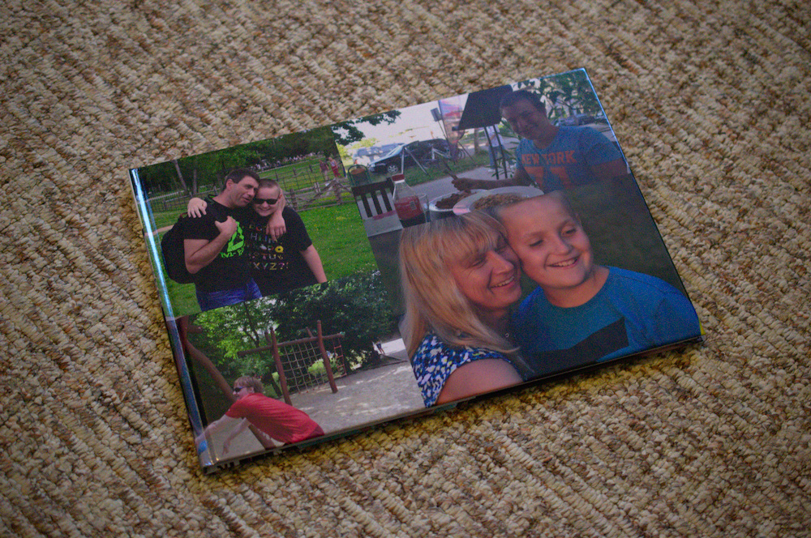
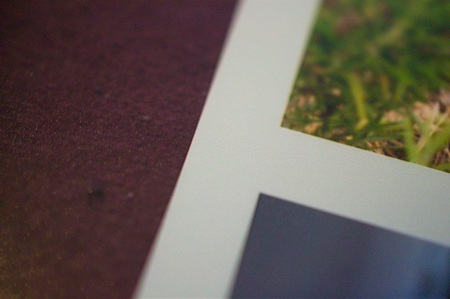
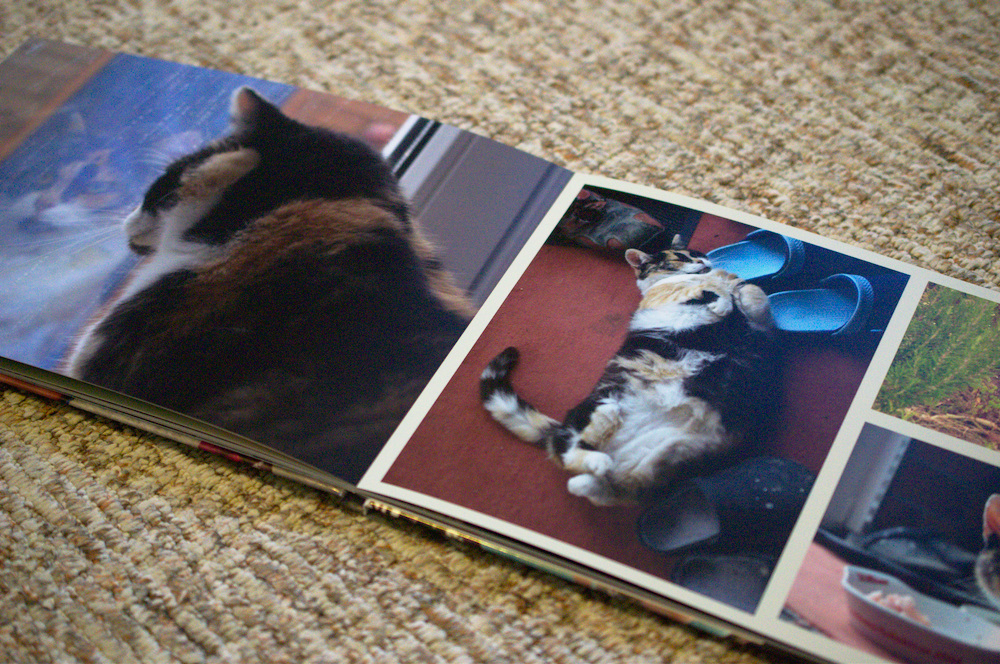
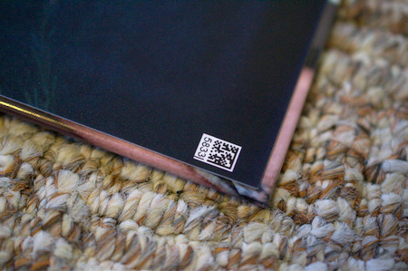
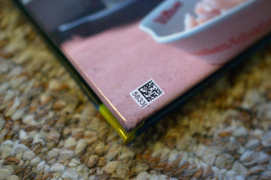

# Review: Fotobuch von Saal Digital

Über Facebook hatte ich die Chance einen 25€ Gutschein für eine Fotobuch-Bestellung bei [Saal Digital](https://www.facebook.com/Saal.Digital/) zu bekommen, wenn ich das Buch am Ende in einer Rezension bewerte. Geld bekomme ich keines dafür, darf das Fotobuch aber behalten.

## Auswahl der Bilder und Format

Gestalten wollte ich schon lange ein Fotobuch mit ein paar Familienbildern. Erfahrungsgemäß guckt man sich die Bilder am Rechner doch eher selten an und bei Feiern etc. reicht man doch lieber mal ein Buch statt einem elektrischen Gerät herum. Schöne Aufnahmen haben sich einige angesammelt sodass hier kein Problem besteht die mindetsens 16 Seiten zu befüllen.

Das Buch gibt es in den üblichen Formaten von 13cm x 20cm über A5 bis A4 jeweils im Hoch- und Querformat und noch ca A3 im Querformat. Wer mag kann auch ein quadratisches Buch mit 12, 19 oder 28cm Kantenlänge bestellen. Ich entschied mich für A4 Querformat da ich dieses als am schönsten empfinde wenn man nicht alleine hinein guckt.

Auch sonst kann man noch viel selbst aussuchen. Alle Details dazu findet man unter http://www.saal-digital.de/fotobuch/

## Gestaltung und Bestellung

Einmal bietet Saal Digital ein eigenes Windows-Programm zur Gestaltung an, aber auch Vorlagen für Photoshop und InDesign sowie alle wichtigen Maße im [Profibereich](http://www.saal-digital.de/service/profibereich/) um alles komplett selbst zu gestalten. Als Linux-Benutzer bin ich da grundsätzlich erstmal etwas eingeschränkt, aber grundsätzlich kann man mit den gegebenen Maßen auch einfach selbst eine PDF-Datei erstellen und diese hoch laden. Das habe ich jedoch nicht gemacht, da ich sowieso mal wieder mit InDesign herum probieren wollte. Also doch Windows und das Adobe-Programm benutzt.

Auch als Laie findet man sich eigentlich recht schnell zurecht und kann je eine PDF für das Cover und die Innenseiten erstellen. Zu beachten ist hier, dass die erste Innenseite wirklich bereits auf der Innenseite des Umschlags liegt. Möchte man also weiße Trennseiten haben, muss man diese extra einfügen. Im [Profibereich](http://www.saal-digital.de/service/profibereich/) findet man noch zusätzliche Hinweise um eine best-mögliche Qualität zu erhalten. An Informationsgehalt konnte ich mir nicht mehr wünschen.

Im Anschluss wird die PDF-Datei einfach hochgeladen und man kann sich nochmal eine Preview ansehen und ggf. auch Seiten umsortieren oder noch weitere einfügen. Wie ich finde ideal gelöst.

Der Versand ging schön schnell: Samstag bestellt, Dienstag geliefert. 

## Das fertige Fotobuch

  
_Das fertige Fotobuch mit selbst gestaltetem Cover_

Das Buch macht einen wertigen Eindruck und fast sich auch schön an. Durch die gewählte Oberfläche reiht es sich auch gut zwischen den anderen Fotobüchern ein. Ich habe auf einigen Seiten mehrere Fotos positioniert. Natürlich sieht man keinen Unterschied im Druck zum Hintergrund, trotzdem wirkte es im ersten Moment angenehm abgehoben. Das hängt sicher auch mit den gewählten Farben zusammen.

_Nahaufnahme eines Bereichs zwischen mehreren Fotos_

  
_Beispiel einer selbst gestalteten Innenseite_

Gegen einen Aufpreis von 5€ kann man den wirklich kleinen Code auf der Rückseite und auf der letzten Seite entfernen lassen. Laut Saal Digital ist dieser durch die Herstellung bedingt. Ich wollte wissen wie sehr er vielleicht stört und habe ihn absichtlich drin gelassen und Bilder für diese Stellen ausgewählt wo es nicht so sehr stören sollte.  
Mein Fazit dazu: Der Code stört nicht wirklich bei den größeren Buch-Formaten. Bei kleineren sollte man vielleicht darauf verzichten, das muss aber jeder selbst wissen.

  
_Der kleine Code auf der letzten Innenseite und der Rückseite_

## Fazit

Ich kann nichts bemängeln. Versand ging schnell, die Qualität ist gut und den Preis halte ich für angemessen und nicht zu teuer. Wer also ein Fotobuch für sich oder andere bestellen möchte sollte unbedingt bei [Saal Digital](https://www.saal-digital.de/) vorbei schauen.
