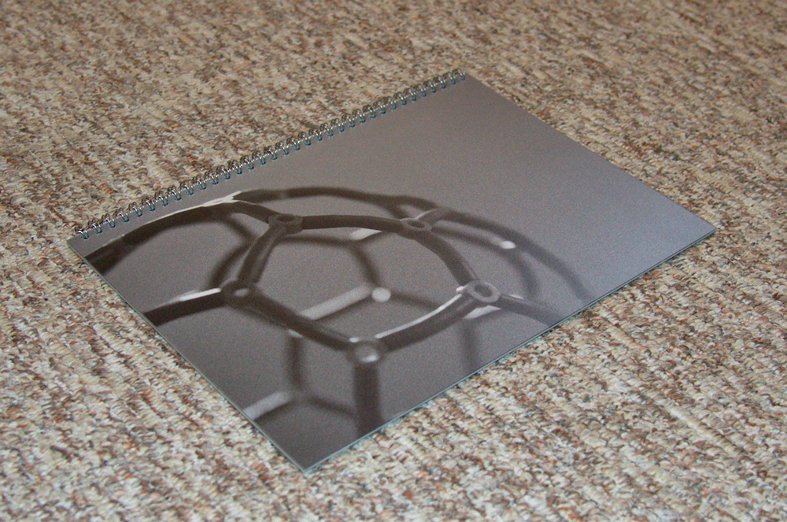
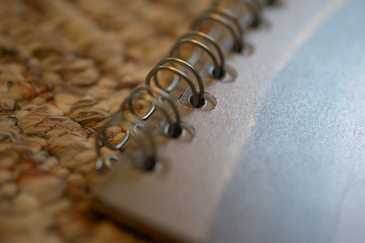
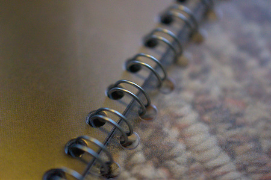

# Review: Fotoheft von Saal Digital

Über Facebook hatte ich die Chance einen 20€ Gutschein für eine Fotobuch-Bestellung bei [Saal Digital](https://www.facebook.com/Saal.Digital/) zu bekommen, wenn ich das Heft am Ende in einer Rezension bewerte. Geld bekomme ich keines dafür, darf das Fotoheft aber behalten.

## Auswahl der Bilder und Format

Über die Zeit haben sich diverse Bilder angesammelt die ich lieber in gedruckter Qualität sehen würde als immer nur auf Displays. Es ist schon ein Unterschied ob man gerade auf ein 96DPI Display oder einen 300 DPI Druck guckt.

Das Heft gibt es in den üblichen Foto-Formaten von 13cm x 20cm über A5 bis A4 jeweils im Hoch- und Querformat und noch ca A3 im Querformat. Wer mag kann auch ein quadratisches Buch mit 14, 20 oder 30cm Kantenlänge bestellen. Ich entschied mich für A4 Hochformat, da es meiner Meinung nach eine angenehme Größe für die ausgewählten Motive hat.

Alle Details zu den Möglichkeiten kann man unter http://www.saal-digital.de/fotoheft/ einsehen.

## Gestaltung und Bestellung

Einmal bietet Saal Digital ein eigenes Windows-Programm zur Gestaltung an, aber auch Vorlagen für Photoshop und InDesign sowie alle wichtigen Maße im [Profibereich](http://www.saal-digital.de/service/profibereich/) um alles komplett selbst zu gestalten. Als Linux-Benutzer bin ich da grundsätzlich erstmal etwas eingeschränkt, aber grundsätzlich kann man mit den gegebenen Maßen auch einfach selbst eine PDF-Datei erstellen und diese hoch laden. Das habe ich jedoch nicht gemacht, da ich sowieso mal wieder mit InDesign herum probieren wollte. Also doch Windows und das Adobe-Programm benutzt.

Auch als Laie findet man sich eigentlich recht schnell zurecht und kann je eine PDF für das Cover und die Innenseiten erstellen. Im [Profibereich](http://www.saal-digital.de/service/profibereich/) findet man noch zusätzliche Hinweise um eine best-mögliche Qualität zu erhalten. An Informationsgehalt konnte ich mir nicht mehr wünschen.

Im Anschluss wird die PDF-Datei einfach hochgeladen und man kann sich nochmal eine Preview ansehen und ggf. auch Seiten umsortieren oder noch weitere einfügen. Wie ich finde ideal gelöst.

Der Versand ging schön schnell: Samstag bestellt, Dienstag geliefert. 

## Das fertige Fotobuch

  
_Das fertige Fotoheft mit dem Bild auf der ersten Seite_

Das Heft ist auf der Vorder- und Rückseite mit einer dicken Plastikfolie versehen um die Innenseiten zu schützen. Dabei ist die jeweils äußere Seite leicht rau, was das Heft besser in der Hand liegen lässt. 

Von der Druckqualität her kann ich nichts bemängeln. Sie ist genau so wie ich sie mir vorgestellt habe.  

  
_Nahaufnahmen der Spiralbindung_

Bei einem Spiralgebundenen Fotoheft ist ein kleiner Teil der Fotos durchlöchert bzw. verdeckt. Das sollte man bei der Gestaltung beachten und etwas mehr Platz einplanen.

## Fazit

Ich kann nichts bemängeln. Der Versand ging schnell, die Qualität ist gut und den Preis halte ich für angemessen und nicht zu teuer. Wer also ein Fotoheft für sich oder andere bestellen möchte sollte unbedingt bei [Saal Digital](https://www.saal-digital.de/) vorbei schauen.
