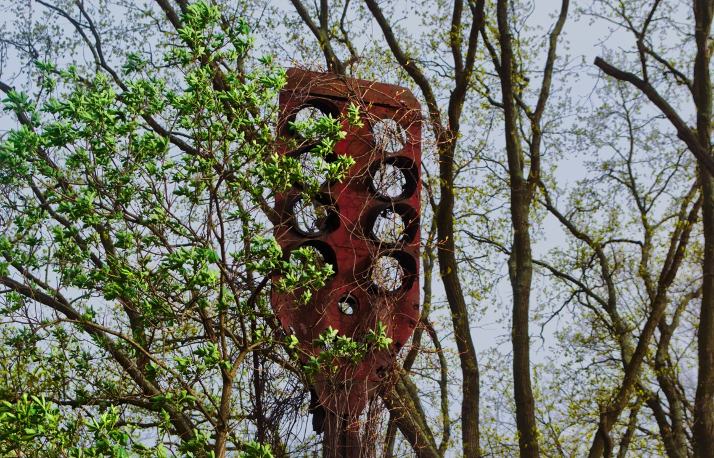

# Review: Wandbild von Saal Digital</h1>

Über Facebook hatte ich die Chance einen Gutschein für eine Wandbild-Bestellung bei [Saal Digital](https://www.facebook.com/Saal.Digital/) zu bekommen, wenn ich das Wandbild am Ende in einer Rezension bewerte. Geld bekomme ich keines dafür, darf das Wandbild allerdings behalten.

Ein Bild zu finden, dass ich mir gerne an die Wand hängen würde war nicht schwer. Nachfolgendes ist es aus verschiedenen Gründen letzten Endes geworden.

## Welche Art von Wandbild?

Welche Art von Wandbild ich mir testweiße bestellen will stand mir frei. Saal Digital bietet da vielseitige Möglichkeiten: Acrylglas, Alu-Dibond-Drucke, Fotoleinwände, Gallery Prints, ... (siehe [Wandbilder](http://www.saal-digital.de/wandbilder/))  
Letzten Endes entschied ich mich für einen Alu-Dibond Butlerfinish&reg;, das heißt, dass das Bild auf eine gebürstete Aluminium-Platte gedruckt wird. Dadurch erscheinen helle Flächen durchscheinend. Für den Himmel in meinem Bild schien mir das gut geeignet zu sein.

Technisch wird bei dieser Art Wandbild mit einem 6-Farb-UB-Direktdruck gearbeitet um die Farben beständig vor Wasser- und Witterungseinflüssen zu machen. Es kann also überall aufgehängt werden. Die UV-Tinten sind durchweg VOC-frei wodurch auch kein typischer Farbgeruch zu erkennen ist.

Die Bildgröße kann man, sofern man mag, Zentimetergenau selbst festlegen; was mir sehr zusagt um ein Bild mit dem von mir gewünschten Seitenverhältnis zu erhalten. Entschieden habe ich mich für ein 39cm breites und 25cm hohes Bild.

Als Aufhängung kommen verschiedene Arten in Frage: Schraub-, Standard- und Profil-Aufhängungen  
Grundsätzlich mag ich Schraubaufhängungen bei dem man in den Ecken Löcher im Bild hat um es dort fest zu schrauben. Als Verblendung verwendet man hier üblicherweiße silberne Abdeckungen. Aufgrund der relativ kleinen Größe des Bildes (viel Platz habe ich leider nicht in meiner Wohnung) entschied ich mich jedoch für eine stabile und nicht sichtbare Profil-Aufhängung.  
Natürlich kann man das Bild aber auch komplett ohne Aufhängung bestellen, dann kann man die bedruckte Platte selbst zu Ende verarbeiten.

Alle Details dieses Wandbilds kann auf auf der Seite von Saal Digital einsehen: http://www.saal-digital.de/wandbilder/alu-dibond-butlerfinish/

## Gestaltung und Auftrag

Saal Digital bietet einerseits die Möglichkeit an ein Programm für Windows herunterzuladen und damit das zu Druckende zu gestalten oder aber den "Profi"-Weg bei dem man alles selbst übernimmt und am Ende einfach die Grafik(en) hochlädt. Als Linux-Benutzer und Kenner meiner gewohnten Bildprogramme wählte ich den Profi-Weg und kann daher nichts zur Windows-Software sagen.

Der Upload verlief ganz unkompliziert. Meine 16 Bit PNG Datei mit 301 DPI wurde sofort akzeptiert und ich erhielt noch den Hinweis <em>"Sehr gute Qualität"</em> - das ist sicher praktisch wenn man nicht so firm mit den Zahlenwerten ist.

## Profil-Aufhängung
