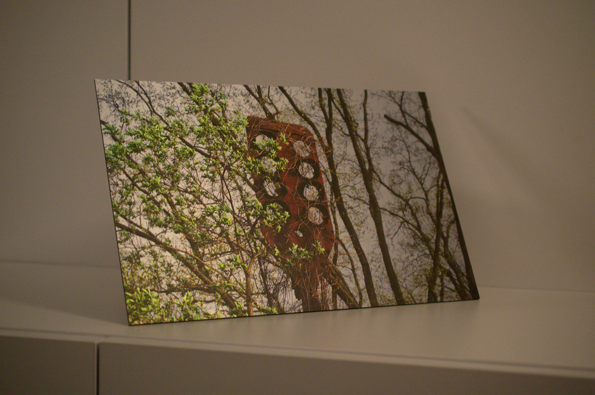

# Review: Wandbild von Saal Digital</h1>

Über Facebook hatte ich die Chance einen 50€ Gutschein für eine Wandbild-Bestellung bei [Saal Digital](https://www.facebook.com/Saal.Digital/) zu bekommen, wenn ich das Wandbild am Ende in einer Rezension bewerte. Geld bekomme ich keines dafür, darf das Wandbild aber behalten.

Ein Bild zu finden, dass ich mir gerne an die Wand hängen würde war nicht schwer. Nachfolgendes ist es aus verschiedenen Gründen letzten Endes geworden.

## Welche Art von Wandbild?

Welche Art von Wandbild ich mir testweiße bestellen wollte stand mir frei. Saal Digital bietet da vielseitige Möglichkeiten: Acrylglas, Alu-Dibond-Drucke, Fotoleinwände, Gallery Prints, ... (für mehr siehe [Wandbilder](http://www.saal-digital.de/wandbilder/))  
Letzten Endes entschied ich mich für einen Alu-Dibond Butlerfinish&reg;, das heißt, dass das Bild auf eine gebürstete Aluminium-Platte gedruckt wird. Dadurch erscheinen helle Flächen durchscheinend. Für den Himmel in meinem Bild schien mir das gut geeignet zu sein.

Technisch wird bei dieser Art Wandbild mit einem 6-Farb-UB-Direktdruck gearbeitet um die Farben beständig vor Wasser- und Witterungseinflüssen zu machen. Es kann also überall aufgehängt werden. Die UV-Tinten sind durchweg VOC-frei.

Die Bildgröße kann man, sofern man mag, Zentimetergenau selbst festlegen; was mir sehr zusagt um ein Bild mit dem von mir gewünschten Seitenverhältnis zu erhalten. Entschieden habe ich mich für ein 39cm breites und 25cm hohes Bild.

Als Aufhängung kommen verschiedene Arten in Frage: Schraub-, Standard- und Profil-Aufhängungen  
Grundsätzlich mag ich Schraubaufhängungen bei dem man in den Ecken Löcher hat um es dort fest zu schrauben. Als Verblendung verwendet man hier üblicherweiße silberne Abdeckungen. Aufgrund der relativ kleinen Größe des Bildes (viel Platz habe ich leider nicht in meiner Wohnung) entschied ich mich jedoch für eine stabile aufgeklebte und nicht sichtbare Profil-Aufhängung.  
Natürlich kann man das Bild aber auch komplett ohne Aufhängung bestellen, dann kann man die bedruckte Platte selbst zu Ende verarbeiten.

  
_Bild der Profil-Aufhängung_

Alle Details dieses Wandbilds kann auf auf der Seite von Saal Digital einsehen: http://www.saal-digital.de/wandbilder/alu-dibond-butlerfinish/  

## Gestaltung und Bestellung

Saal Digital bietet einerseits die Möglichkeit an ein Programm für Windows herunterzuladen und damit das zu Druckende zu gestalten oder aber den "Profi"-Weg bei dem man alles selbst übernimmt und am Ende einfach die Grafik(en) hochlädt. Als Linux-Benutzer und Kenner meiner gewohnten Bildprogramme wählte ich den Profi-Weg und kann daher nichts zur Windows-Software sagen. Alle hierfür benötigten Informationen (Abmessungen etc.) sowie Vorlgen für InDesign und Photoshop gibt es ebenfalls (http://www.saal-digital.de/wandbilder/profibereich/)

Der Upload verlief ganz unkompliziert. Meine 16 Bit PNG Datei mit 301 DPI wurde sofort akzeptiert und ich erhielt noch den Hinweis _"Bildqualität sehr gut"_ - das ist sicher praktisch wenn man nicht so firm mit den Zahlenwerten ist.

Allgemein mag ich den Web-Editor: Er zeigt einem alles wichtige an (Optimale DPI, passende Pixel-Abmessungen), lädt in einer angemessenen Geschwindigkeit und hatte bei mir keine Probleme. Außerdem werden auch alle von mir getesteten Dateiformate akzeptiert (PNG, JPG, TIFF und vor allem auch PDF)

  
_Screenshot des Online-Editors (Im Nachhinein erstellt, daher ggf. andere Werte)_

Ich hatte ja einen Gutschein für das Bild, im Normalfall muss man natürlich bezahlen. Mit Versand kostet meine Ausführung 47,90€, was ich angemessen finde. Bezahlt werden kann mit _PayPal_, _MasterCard_, _VISA_, _Lastschrift_ und per _Rechnung_

Der Versand erfolgt gut verpackt per DHL und meiner Erfahrung nach schneller als ursprünglich auf der Seite angegeben. (Geht aus bisher 3 einzelnen Bestellungen hervor) Anstatt Montag kam das Paket bereits am Donnerstag zuvor an. Das wird also nicht sinnlos hinaus gezögert wie es leider einige andere Online-Shops machen.

## Das fertige Bild

Fantastisch! Das Bild sieht eigentlich genau so aus wie ich es mir vorgestellt habe. Der Kratz-Effekt ist wirklich toll, vor allem wenn sich Licht darüber spiegelt. Man könnte meinen, dass die Sonne auf dem Himmel entlang wandert.
Das kann man leider nur schwer in Worte ausdrücken und auch meine Fotos spiegeln es nur eingeschränkt wieder.

  
_Zwei Bilder des fertigen Drucks, schräg mit einer provisorischen Halterung aufgestellt_

Wenn man sehr nah ran geht sieht man dann auch den Kratz-Effekt etwas deutlicher, im allgemeinen ist er aber angenehm unauffällig und zeigt sich wirklich nur im durchscheinen der hellen Flächen und der schönen Reflektionen.

  
_Detailaufnahmen des Drucks. Anklicken für größere Ansicht (größer als 10MB pro Bild)_

## Aufhängung

Zur Profilaufhängung kann ich noch nicht viel sagen. Da ich erst kürzlich umgezeogen bin steht es erstmal wie oben abgebildet auf einem Schrank. Sieht auch schick aus und mit der Profil-Aufhängung kann man da auch leicht selbst etwas basteln.

## Fazit

Ich kann nbichts bemängeln. Versand ging schnell, die Qualität ist fantastisch und den Preis halte ich für angemessen und nicht zu teuer. Wer also ein Wandbild für sich oder andere bestellen möchte sollte unbedingt bei [Saal Digital](https://www.saal-digital.de/) vorbei schauen.
